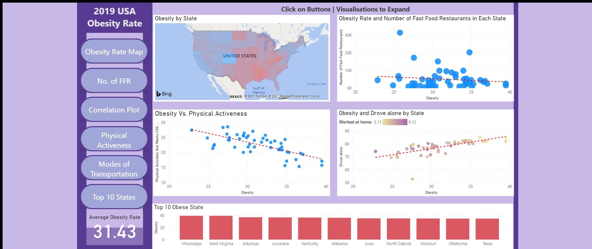
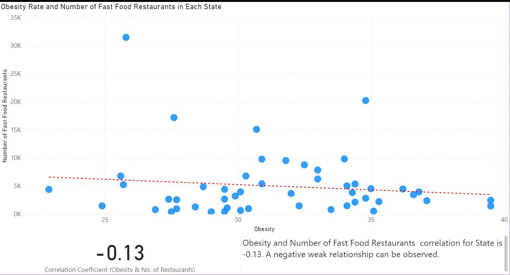
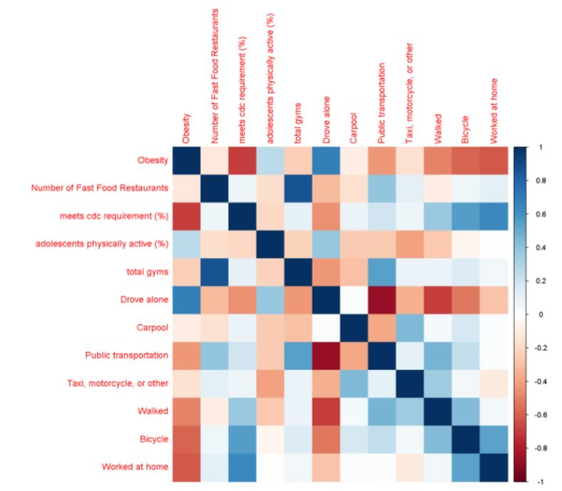
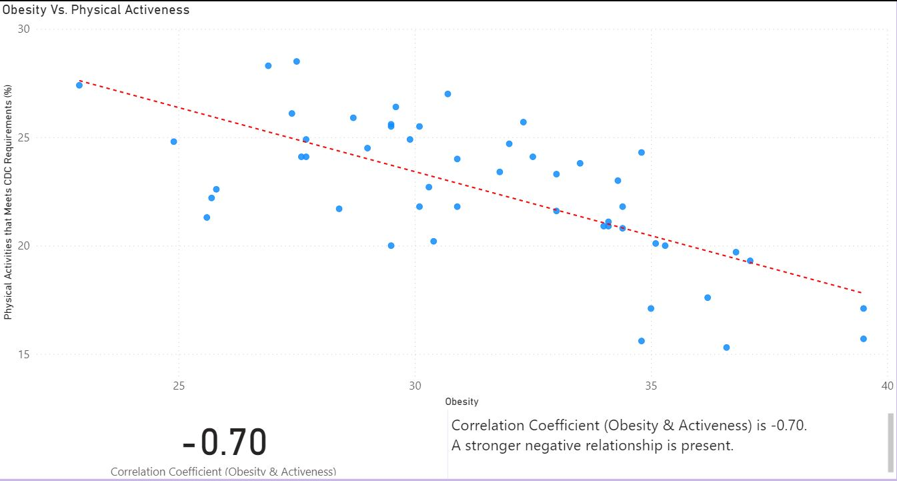
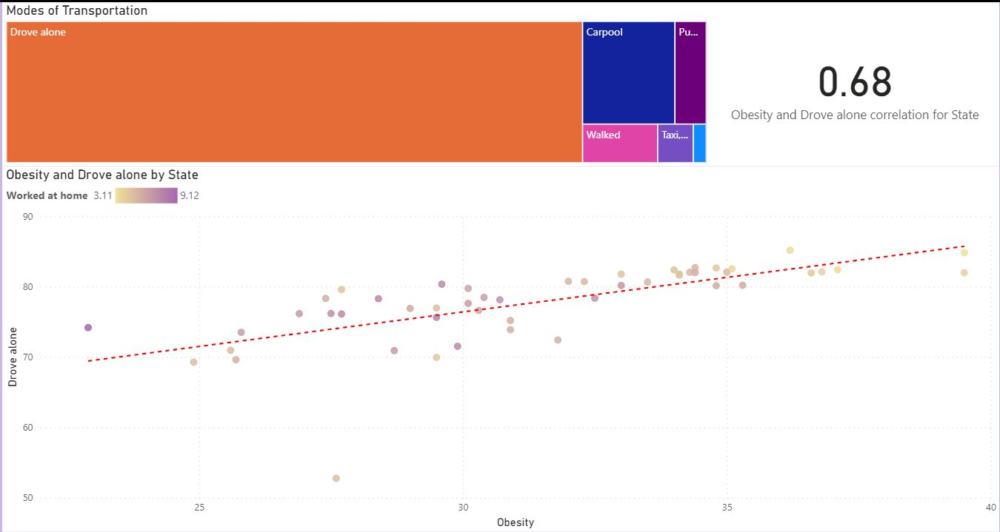
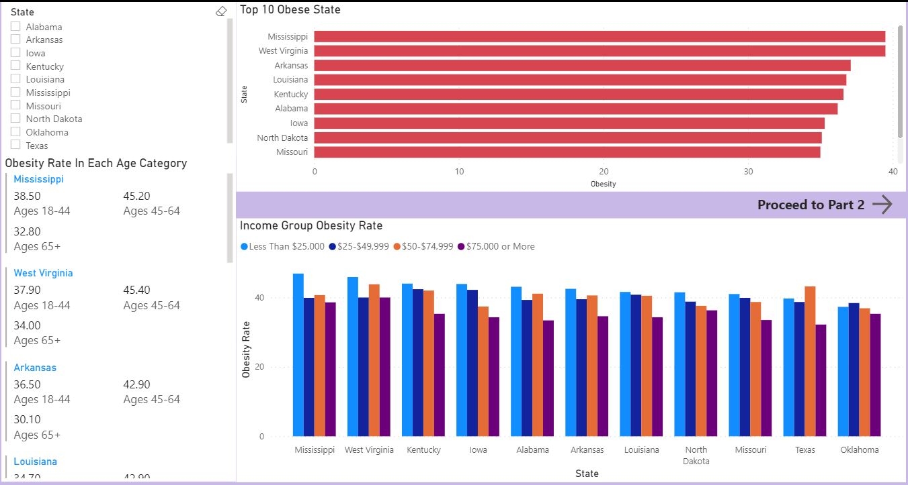
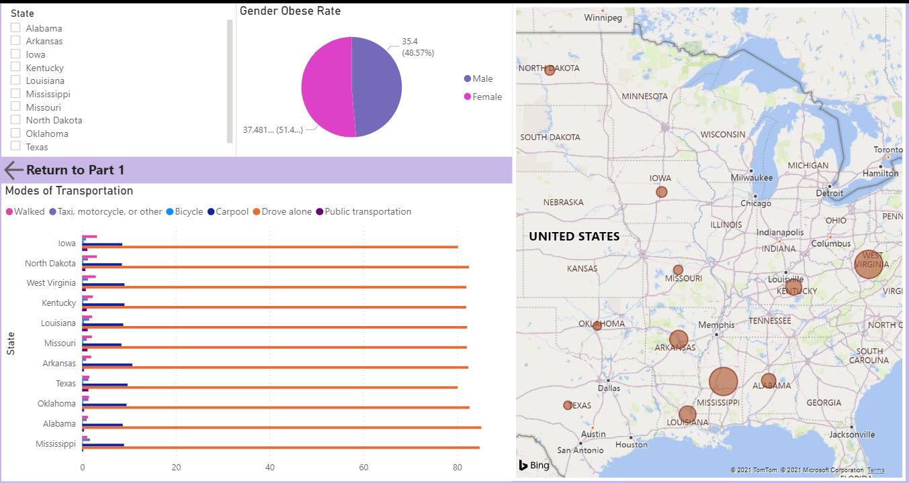

<h3>Obesity Rate in USA - Project Obesity Ver. 2.0</h3>

A Re-do of 1st Project - <a href= "https://github.com/foofx88/Project_Obesity">Project Obesity</a> with Microsoft's Power BI visualisation and further analysis on the data.

I have decided to give the dataset a second run due to the following reasons:

<ul>
  <li>Limited capabilities and visualisations being the 1st project from the course</li>
  <li>Previously a group effort, I want to showcase what I can do with the dataset on my own</li>
  <li>Perform full ETL on the dataset and visualize them with Power BI</li> 
  <li>Add interactive elements for user to easily understand and make sense of the dataset through more visualisations</li> 
  <li>Potential in the dataset to be further explored</li>
</ul>

Once <a href="https://github.com/foofx88/ObesityRate-USA/tree/main/datasets/cleaned">datasets</a> are cleaned, the datasets are then visualised using Power BI as follows

Eventhough the <a href="https://foofx88.github.io/ObesityRate-USA/">Main Reports</a> page is the first landing page, it as created last. Here we can navigate to the other reports with ease. A hover over guides users through on what to expect when they click on the button or the visuals. This report page was created with a combination of visuals, buttons linking to bookmarks, and shapes.

I wanted to replicate the visuals used on the 1st project and identify the relationships. The first visual created was the Obesity Rate vs. No. of Fast Food Restaurants.
One would assume that the more Fast Food Restaurants available would lead to higher Obesity Rate. 

To identify the relationship, a scatter plot was initially plotted. Then a Trend line was added under Analytics. The Correlation Coefficient(CC) was calculated using Quick Measures and its available CC calculations within Power BI. By setting "State" as Category, "Sum of Obesity" as Measure X and "Sum of Fast Food Restaurants" as Measure Y. 

Oddly, a weak negative relationship can be observed from the plot as well as the calculations. What else would have caused Obesity Rates if not Fast Food Restaurants availability?

I needed to explore further, what caused Obesity. As Power BI has a library of visualisations, I've used the <a href="https://appsource.microsoft.com/en-us/product/power-bi-visuals/WA104380814?src=office&tab=Overview">Correlation Plot</a> to highlight the most correlated variables in the datasets. I've pinned every possible measure against Obesity and the following was the result of the Correlation Plot:

Exploring the Correlation plot further suggests that "Physical Activeness" (meets cdc requirement(%)) and "Drove alone" have a higher value compared to Number of Fast Food Restaurants. Therefore, I would then look at these 2 relationships.

Utilizing the similar method used to calculate the CC for Number of Fast Food Restaurants, I was able to replicate the 2 measurements relationship with Obesity swiftly.

On the plot where Obesity Rate vs. Physical Activeness, it has been identified that the least active a state is, the higher their obesity rate.

As for the modes of transportation, the higher percentage a state population is to drive alone, the higher the obesity rates. The other factor that I have included in this was the "Worked from Home" measure. Those who drove alone did not work from home much, hence spending more commute time in the car to and from work.  

Upon having the relationships identified, I wanted to further visualised the demographics data. However, I want to only see the Top 10 Obese states.
To archive this, I used Data Analysis Expressions (DAX) in New Measure under Modeling. I used the TOPN formula to get just the Top 10 states. As there is so much data to visualise, I split the demographics into 2 pages.

The 1st page includes a Slicer to select the State, all states are shown by default however multiple states can be selected to compare each states' values. I have placed The Top 10 states with the Obesity rates, Obesity Rate in each Age Category and the Obesity Rate of each Income Groups. To navigate to the next page, I used a button.

As the 2nd page also have the same slicer, I Synced the slicers so if state(s) selected on the 1st page, would "carry over" to the 2nd page and vice versa. The Top 10 Obese states are all on the East Coast of USA and we can see on average there are more obese Female than Male but not by a large margin.

Unfortunately the Power BI report cannot be publish due to disabled embed code creation

